### Portfolio Vytautas Dvelys
### Junior Front end Developer
[VytautasDvelys@gmail.com](mailto:vytautasdvelys@gmail.com)

##Portfolio site - soon...
Working on small projects/websites. For private uses and local networks.

##
## Last work

### „Vilnius Coding School“ (course final project)
[WordPress version](http://codingschoolprojektai.lt/tmp/kgbootcamp/vytautas_dvelys/wp/) | [HTML version](http://codingschoolprojektai.lt/tmp/kgbootcamp/vytautas_dvelys/html)
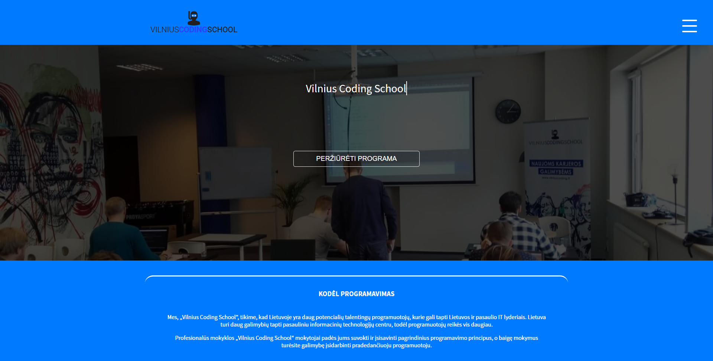

### L2Soft
[https://l2soft.eu](https://l2soft.eu)
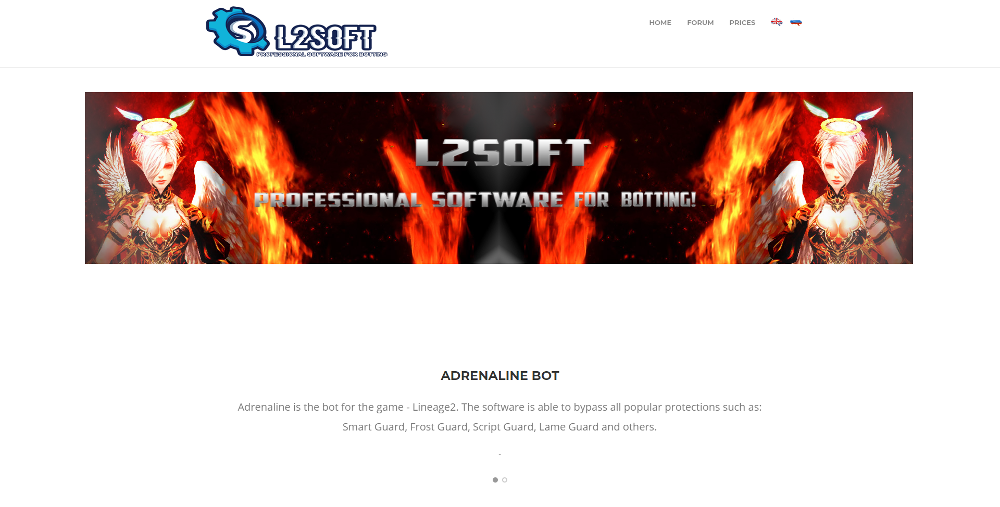

### Burger menu
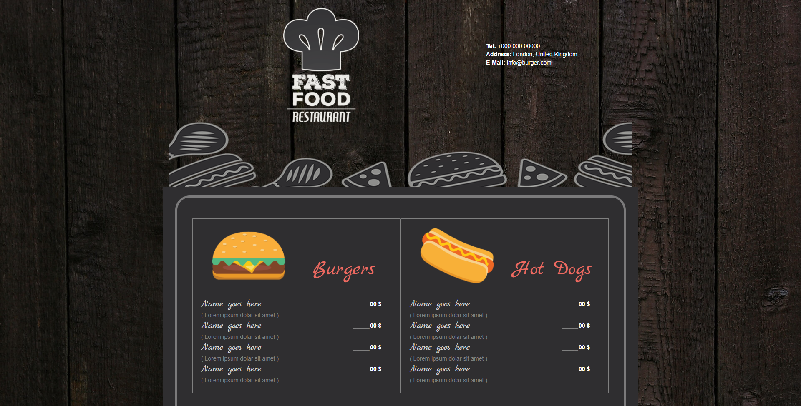

### SipSap
[http://sipsap.eu](http://sipsap.eu) | [read code](sipsap/index.html)
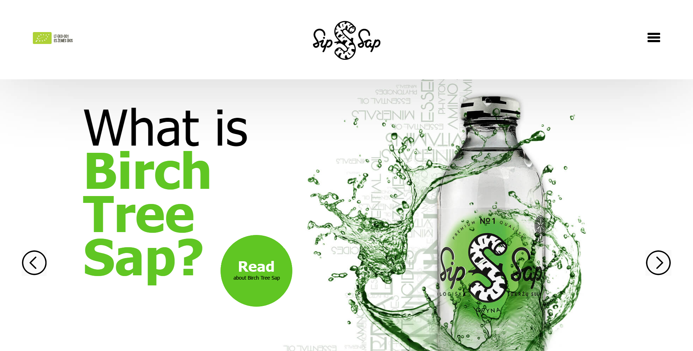

### Erlita
[read code](erlita/index.html)
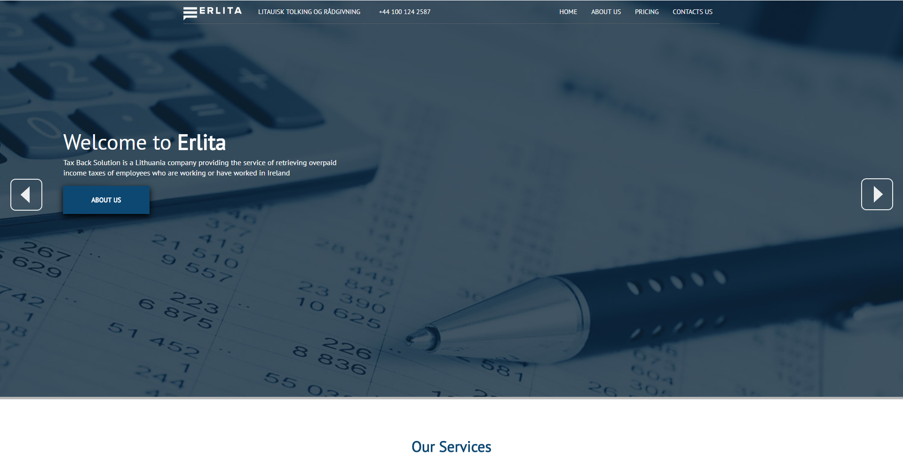
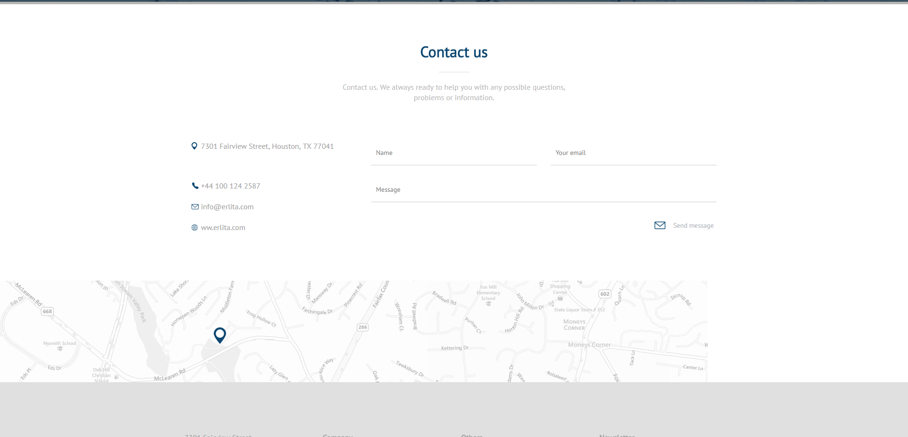

### MouldEliminators
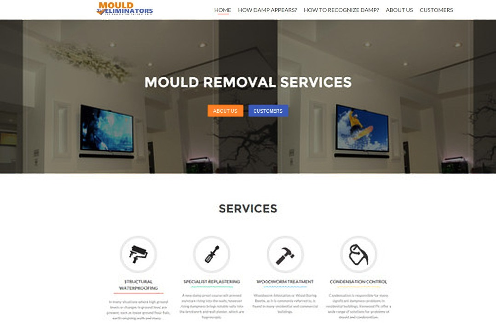
##
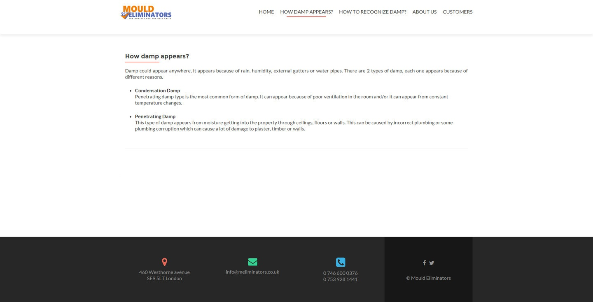

### Liberty
[https://libfc.ca](http://libfc.ca)
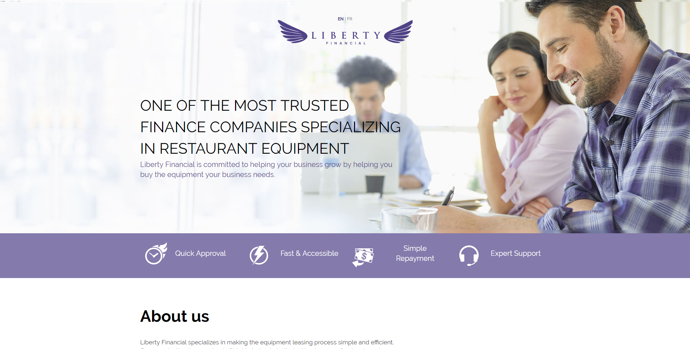

### Manage My Buildings Blog
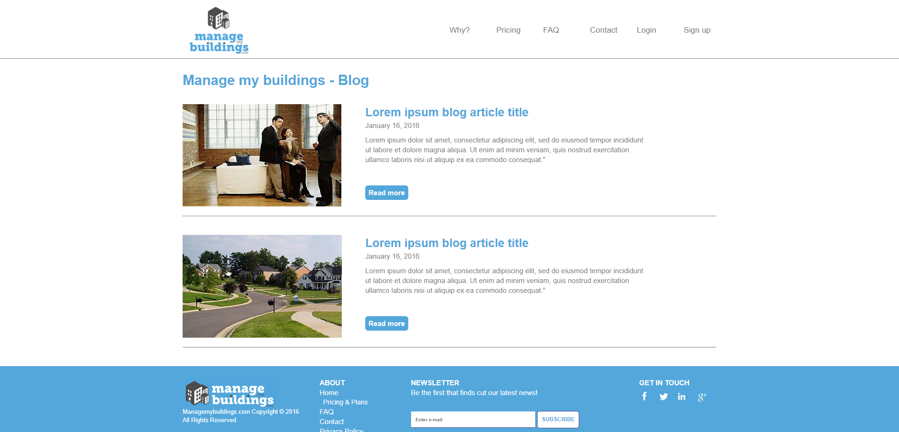

### ReflexPoint
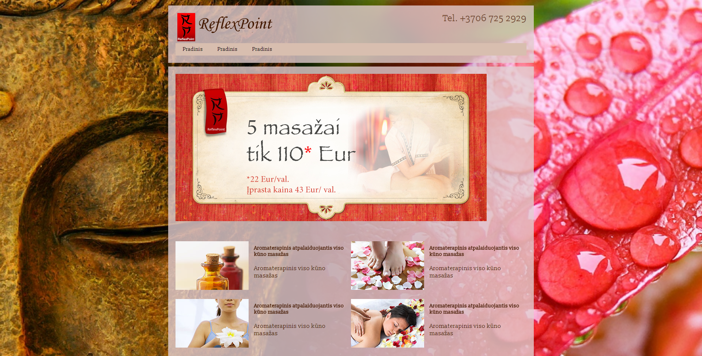
